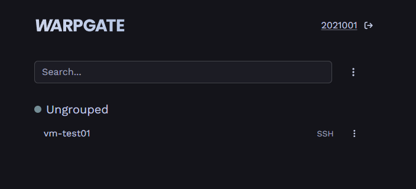
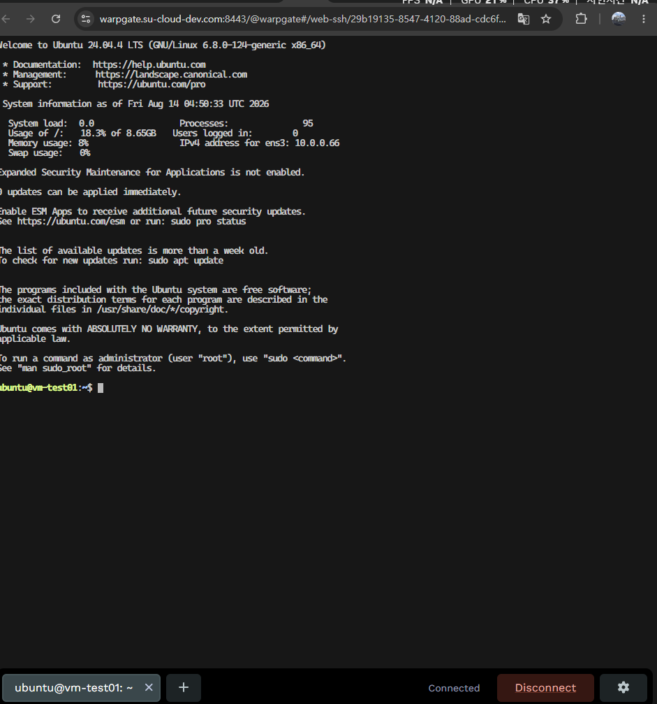

# Warpgate 웹터미널 구축·검증 절차 (개발계 리허설) - 실측 반영

> **출처**: Notion 「Warpgate 웹터미널 구축·검증 절차 (개발계 리허설) - 실측 반영」 · 레포 정리 2026-09-05
> 작성일 2026-08-14 (개발계 `.180` 실측 기준). 이미지는 `images/warpgate-setup/`.
> Warpgate admin 비밀번호는 레포에 남기지 않기 위해 마스킹했다. 원본은 Notion 참고.


> 작성일: 2026-08-14 (0-1 실측 완료 — 가정값 전부 확정값으로 치환)
목적: 운영계 진행 전 개발계(.180, ThinkCentre)에서 전체 절차를 리허설하고 POC ①②③을 소거
전제: 개발계 kolla 배포 완료(OVS), Tailscale 접속 가능
원칙: **운영 구조(nginx → 127.0.0.1:9443 Warpgate)를 그대로 유지** — 여기서 통과한 검증이
운영계에서 값 치환만으로 재현되도록 한다
표기: [실측] 2026-08-14 확인값 · [운영 차이] 운영계와 값이 다른 항목
> 

---

## 0. 개발계 환경 값 [실측 2026-08-14]

| 항목 | 개발계 | 운영계 (참고) |
| --- | --- | --- |
| 호스트 | ThinkCentre (su-cloud-dev) | P520 (su-cloud-prod) |
| Tailscale IP | 100.114.87.22 [운영 차이] | 100.119.138.65 |
| 공인 IP | 210.94.240.180 (kolla 고정) [운영 차이] | .179 / .181 |
| venv 경로 | `/opt/kolla-venv` (운영계와 동일) | `/opt/kolla-venv` |
| 네트워크 백엔드 | ML2/OVS — Metadata·DHCP·L3·OVS agent 4개 모두 UP [운영 차이] | ML2/OVN — agent 2개 |
| external 구성 | veth pair + 이중 NAT [운영 차이] | brbond0 직결 |
| **호스트 게이트웨이** | **veth0 = 192.168.100.1/24** (br-ex는 IP 없음·DOWN — OVS 브리지 전용, 정상) | br-ex 192.168.200.1/24 |
| external 네트워크 | **provider.network** / provider.subnet **192.168.100.0/24** [운영 차이 — 운영계 이름·대역은 `openstack network list --external`로 재확인 필요] | (public 가정 — 미확인) |
| 테넌트 네트워크 | **internal.network** / 10.0.0.0/24 | 학생망 (미확정) |
| 기존 FIP | **7개 사용 중** (192.168.100.13~181, 민기·지원 검증 VM 추정) — **건드리지 말 것** | — |
| NAT | POSTROUTING: `MASQUERADE 192.168.100.0/24 → any` + ts-postrouting — 이중 NAT 핵심, 보존 필수 | 해당 없음 |
| INPUT 체인 | 정책 ACCEPT, neutron-openvswi-INPUT + ts-input만 — **보호 규칙 없음(무방비)** | 동일 패턴 |
| .180 노출 | Keystone 5000·Horizon 80·MariaDB 3306·memcached 11211·libvirt 16509·RabbitMQ·novnc 6080 등 교내 노출 중 | 동일 패턴 |
| 기존 nginx | **호스트에 이미 기동 중 — 0.0.0.0:443, 0.0.0.0:8888 점유** (민기 L2 라우팅 검증분 추정) | 없음 (신규) |
| 개발계에만 있는 것 | haproxy(1984·61313), heat(8000·8004) — 운영계와 구성 차이, 기록만 | — |
| OVS CLI | 호스트에 ovs-vsctl 없음 — `sudo docker exec openvswitch_vswitchd ovs-vsctl show` | 동일 (OVN 계열) |

접속 표준 절차:

```
ssh ubuntu@100.114.87.22
source /opt/kolla-venv/bin/activate
source /etc/kolla/admin-openrc.sh
```

착수 전 마지막 확인 1건 — 기존 FIP로 도달 경로 소거:

```
ping -c3 192.168.100.15        # 성공 시 검증 4-1의 1번은 원리 확인 완료로 간주
```

---

## 1. 리허설 구조

운영 구조와 동일하되 입구만 Tailscale. 공인망 요소(.181, 캠퍼스 방화벽, 정식 DNS)가
없으므로 운영계 문서의 "임시 검증(6장)" 구성이 곧 개발계의 본 구성이 된다.

```
Tailscale:8443  nginx(기존 기동분에 server 블록 추가) ── TLS 종단 (dev 와일드카드)
                  └─ warpgate.su-cloud-dev.com → proxy_pass → 127.0.0.1:9443 (Warpgate HTTP)
Tailscale:2222  Warpgate SSH 직접 바인딩

테스터 ──8443──> nginx ──> Warpgate(127.0.0.1:9443) ──22──> VM FIP (192.168.100.x)
테스터 ──2222──────────> Warpgate ────────────────────22──> VM FIP (192.168.100.x)
```

포트 충돌 없음 [실측]: 기존 nginx는 443·8888, Warpgate 프론트는 8443·9443·2222.

### 목표 흐름

```
브라우저: <https://warpgate.su-cloud-dev.com:8443> → 로그인(학번) → 본인 VM만 → 웹터미널
SSH:     ssh 학번:vm-test01@100.114.87.22 -p 2222
scp:     scp -P 2222 test.txt 학번:vm-test01@100.114.87.22:~/
```

DNS: Cloudflare에서 `warpgate.su-cloud-dev.com A 100.114.87.22` 등록.
Tailscale 대역(100.x)은 사설이지만 퍼블릭 DNS 등록 무방 — tailnet 밖에서는 도달 불가.

---

## 2. 사전 작업

### 2-1. iptables — .180 보호 (선택이지만 권장)

> **나중에 진행 예정**

운영계 작업의 리허설을 겸해 .180도 같은 패턴으로 잠근다. [실측]에서 INPUT 무방비 확인됨.

**이중 NAT 주의 [실측 확정]:** POSTROUTING에 `MASQUERADE 192.168.100.0/24`(VM 아웃바운드
핵심)와 ts-postrouting, INPUT에 neutron-openvswi-INPUT(OVS 하이브리드 방화벽)·ts-input
체인이 이미 있다. 이 작업은 **INPUT 체인 append만** 사용한다. flush(-F) 절대 금지.
기존 체인들보다 뒤에 append되므로 neutron·tailscale 동작에 영향 없음.
netfilter-persistent save 시 기존 NAT 규칙도 함께 저장되는데, 이는 의도된 동작이다.

```
sudo iptables -A INPUT -i lo -j ACCEPT
sudo iptables -A INPUT -i tailscale0 -j ACCEPT
sudo iptables -A INPUT -m conntrack --ctstate ESTABLISHED,RELATED -j ACCEPT
sudo iptables -A INPUT -d 210.94.240.180 -j DROP

sudo apt install -y netfilter-persistent iptables-persistent
# 저장은 무해 확인 후
```

무해 확인 — 개발계는 이중 NAT 경유 VM 통신이 있으므로 확인 항목이 하나 많다:

```
openstack service list              # API 정상
openstack network agent list        # 4개 agent UP 유지
ping -c3 192.168.100.15             # 기존 FIP 도달 유지 (호스트→VM은 FORWARD/veth 경로 — 영향 없어야 정상)
# VM 내부에서: curl -s ifconfig.me  # → 210.94.240.180 (이중 NAT 생존)

sudo netfilter-persistent save
```

주의: 민기·지원이 기존 nginx(443)로 검증 중인 서비스가 있다면 .180 DROP이 교내 접속을
끊는다. **적용 전 팀 공유 필수** — 이후 접속은 Tailscale 경유로 통일.

---

### 2-2. 학생 VM 전용 시큐리티 그룹 [실측값 확정]

```
openstack security group create student-vm --description "student VM: SSH from Warpgate host only"
openstack security group rule create --protocol tcp --dst-port 22 \
  --remote-ip 192.168.100.1/32 student-vm      # veth0 — 호스트 게이트웨이 실측값
```

default SG를 쓰지 않는 이유(그룹 내 전 포트 상호 허용 → 학생 간 SSH 우회)도
개발계에서 그대로 재현·검증된다 — 4-1의 7번 항목.

---

## 3. 구축

### 3-1. Warpgate 설치

```
sudo mkdir -p /opt/warpgate && cd /opt/warpgate
sudo tee docker-compose.yml <<'EOF'
services:
  warpgate:
    image: ghcr.io/warp-tech/warpgate:latest
    restart: unless-stopped
    network_mode: host
    volumes:
      - /var/lib/warpgate:/data
EOF

sudo mkdir -p /var/lib/warpgate
sudo chmod 777 /var/lib/warpgate      # setup용 임시 — 아래에서 다시 조임

sudo docker compose run --rm warpgate setup
sudo docker compose up -d
```

setup 대화형에서 물어볼 것들, 이렇게 답:

| 질문 | 입력 |
| --- | --- |
| data directory | 기본값(/data) 엔터 |
| HTTP endpoint | **127.0.0.1:9443** |
| SSH 활성화 | yes → **100.114.87.22:2222** |
| MySQL/PostgreSQL | **no** (안 씀) |
| 세션 녹화 | yes |
| admin 비밀번호 | <admin 비밀번호 — 레포에 기록하지 않음> |

network_mode: host 필수 — Warpgate → VM 아웃바운드의 출발지가 veth0(192.168.100.1)이
되어야 student-vm SG 규칙과 일치한다. 브리지 모드면 출발지가 도커 대역(172.17.0.x)이
되어 SG에 걸리지 않고, 개발계는 이중 NAT까지 겹쳐 경로가 한 층 더 꼬인다.

### 3-2. Warpgate 리슨·리스너 정리

v0.27.5 setup은 리슨 주소를 대화형으로 묻지 않는다 (녹화 여부·admin 비밀번호만 질문,
리스너는 전부 [::] 기본값). 따라서 **setup 후 yaml 수정이 필수 단계**다.

설정 파일: 호스트 경로 /var/lib/warpgate/warpgate.yaml (컨테이너 /data/warpgate.yaml).

```
sudo sed -i \
  -e "s|^external_host: null|external_host: \"warpgate.su-cloud-dev.com\"|" \
  -e "s|listen: '\[::\]:2222'|listen: '100.114.87.22:2222'|" \
  -e "s|listen: '\[::\]:8888'|listen: '127.0.0.1:9443'|" \
  -e "/^kubernetes:/,/^[a-z]/ s/^  enable: true/  enable: false/" \
  -e "/^mysql:/,/^[a-z]/ s/^  enable: true/  enable: false/" \
  -e "/^postgres:/,/^[a-z]/ s/^  enable: true/  enable: false/" \
  /var/lib/warpgate/warpgate.yaml

grep -E "external_host|listen: '|enable:" /var/lib/warpgate/warpgate.yaml
```

수정 후 권한 회수(3-1의 chmod 777 원복) 및 기동:

```
ls -ln /var/lib/warpgate

sudo chown -R <uid>:<uid> /var/lib/warpgate # 위에서 uid 확인 후 수정
sudo chown -R 1000:1000 /var/lib/warpgate

sudo chmod 700 /var/lib/warpgate

sudo docker compose up -d
sudo ss -tlnp | grep -E ':9443|:2222'
sudo ss -tlnp | grep -E ':8888|:8443|:33306|:55432' | grep -v nginx
```

주의: SSH가 Tailscale IP 바인딩이므로 tailscaled 기동 후에야 warpgate가 뜬다.
부팅 직후 지연을 장애로 오인하지 말 것.

### 3-3. nginx — 기존 기동분에 server 블록 추가 [실측 확정]

호스트에 nginx가 이미 443·8888로 기동 중이므로 **신규 설치 없이 블록만 추가**한다.
기존 map/server 블록은 수정하지 않는다 — 이 공존 자체가 Phase 3 구조의 선행 검증.

```html
sudo certbot certificates
```

```
sudo tee /etc/nginx/sites-available/warpgate > /dev/null <<'EOF'
server {
    listen 100.114.87.22:8443 ssl;              # [운영 차이] 운영계는 .181:443
    server_name warpgate.su-cloud-dev.com;      # [운영 차이] 운영계는 syu.ac.kr

    ssl_certificate     /etc/letsencrypt/live/su-cloud-dev.com/fullchain.pem;
    ssl_certificate_key /etc/letsencrypt/live/su-cloud-dev.com/privkey.pem;

    location / {
        proxy_pass https://127.0.0.1:9443;
        proxy_http_version 1.1;
        proxy_set_header Upgrade $http_upgrade; # WebSocket 필수
        proxy_set_header Connection "upgrade";  # WebSocket 필수
        proxy_set_header Host $host;
        proxy_set_header X-Forwarded-For $remote_addr;
        proxy_set_header X-Forwarded-Proto https;
        proxy_read_timeout 3600s;               # 세션 유지 핵심
        proxy_send_timeout 3600s;
    }
}
EOF

sudo ln -s /etc/nginx/sites-available/warpgate /etc/nginx/sites-enabled/
sudo nginx -t && sudo systemctl reload nginx    # reload — 기존 서비스 무중단
```

dev 와일드카드 인증서([su-cloud-dev.com](http://su-cloud-dev.com/), DNS-01)가 없거나 만료면:

```
sudo certbot certificates                            # 현황 먼저
sudo certbot certonly --dns-cloudflare \
  -d "*.su-cloud-dev.com" -d "su-cloud-dev.com"
```

```html
curl -k https://127.0.0.1:9443/ -o /dev/null -w "%{http_code}\n"
curl -k https://100.114.87.22:8443/ -H "Host: warpgate.su-cloud-dev.com" -o /dev/null -w "%{http_code}\n"
curl -k https://100.114.87.22/ -o /dev/null -w "%{http_code}\n"
```

- Cloudflare에 `warpgate.su-cloud-dev.com A 100.114.87.22` 레코드 추가 (Proxy는 **DNS only** 회색 구름 — 오렌지 켜면 Cloudflare가 100.x로 프록시 못 해서 깨짐)
- tailnet 조인된 노트북에서 `https://warpgate.su-cloud-dev.com:8443/` → 정식 인증서로 경고 없이 로그인 화면 떠야 함
- admin 로그인 → 좌측 admin 패널 진입 확인

```html
id: admin
pw: <admin 비밀번호 — 레포에 기록하지 않음>
```

- 접속

### 3-4. Warpgate 공개키 → keypair (1회)

```
sudo docker compose exec warpgate warpgate client-keys

echo "ssh-ed25519 AAAAC3NzaC1lZDI1NTE5AAAAINDRwB2zn8266HUauQBMolKYenABuiklWl0PXgq14Zyw client-ed25519" > /tmp/wg.pub
openstack keypair create --public-key /tmp/wg.pub warpgate
openstack keypair list    # warpgate 보이면 통과
```

### 3-5. 테스트 VM 생성 — 2대 (격리 검증용으로 반드시 2대) [네트워크명 확정]

```
# ── 1단계: 생성만 ──
for id in test01 test02; do
  openstack server show vm-$id > /dev/null 2>&1 && { echo "vm-$id 이미 존재 — 건너뜀"; continue; }
  openstack server create \
    --flavor bastion-small \
    --image ubuntu-24.04 \
    --network internal.network \
    --key-name warpgate \
    --security-group student-vm \
    vm-$id
done

# ── 2단계: ACTIVE 폴링 ──
for id in test01 test02; do
  echo -n "vm-$id: "
  for i in $(seq 1 30); do
    STATUS=$(openstack server show vm-$id -f value -c status)
    [ "$STATUS" = "ACTIVE" ] && { echo "ACTIVE"; break; }
    [ "$STATUS" = "ERROR" ]  && { echo "ERROR — console log 확인 필요"; break; }
    sleep 5
  done
done

# ── 3단계: FIP 연결 — 미연결 FIP 재사용, 없으면 신규 ──
for id in test01 test02; do
  FIP=$(openstack floating ip list --status DOWN -f value -c "Floating IP Address" | head -1)
  [ -z "$FIP" ] && FIP=$(openstack floating ip create provider.network -f value -c floating_ip_address)
  openstack server add floating ip vm-$id $FIP
  echo "vm-$id -> $FIP"
done

# ── 확인 ──
openstack server list | grep vm-test
```

기존 FIP 7개(192.168.100.13~181)와 기존 VM은 민기·지원 검증분이므로 건드리지 않는다.

### 3-6. Warpgate 타깃·사용자·롤 등록

VM 2대 ACTIVE + FIP 연결 완료, 고아 FIP도 깔끔하게 재사용됐어.

| VM | 내부 | FIP |
| --- | --- | --- |
| vm-test01 | 10.0.0.66 | **192.168.100.28** |
| vm-test02 | 10.0.0.177 | **192.168.100.43** |

도달 확인:

```bash
nc -zv 192.168.100.28 22
nc -zv 192.168.100.43 22
```

통과하면 Admin UI(`https://warpgate.su-cloud-dev.com:8443` → Admin)에서 3-6 등록. 실제 값으로:

**Roles → Add:** `role-2021001` 만들고 타깃 vm-test01 + 유저 2021001 할당 / `role-2021002`에 vm-test02 + 2021002. admin 롤에 신규 타깃이 자동 포함될 수 있는데, 학생 계정엔 본인 롤만 붙이면 격리 성립.

```html
Admin → Config → Access Roles → role-2021001, role-2021002 생성
```

**Users → Add:** `2021001`, `2021002` — 각각 비밀번호 credential 추가 (Password 항목에서 설정)

```html
Username 2021001 → 저장 후 상세에서 Credentials에 Password 추가 (이게 없으면 로그인 수단이 없어) → Roles에서 role-2021001 할당
```

**Targets → Add a target → SSH:**

| 항목 | vm-test01 | vm-test02 |
| --- | --- | --- |
| Name | vm-test01 | vm-test02 |
| Host | 192.168.100.28 | 192.168.100.43 |
| Port | 22 | 22 |
| Username | ubuntu | ubuntu |
| Auth | **Public key** (Warpgate 자체 키 사용) | Public key |

추가 이후 check host key 진행

등록 끝나면 본 검증 4·5·6번 연타:

```html
2021001 (test user 1)

id: 2021001
pw: 2021001
```

```html
2021002 (test user 2)

id: 2021002
pw: 2021002
```

```
브라우저(시크릿 창): 2021001 로그인 → vm-test01만 보임 → 클릭 → 웹터미널
SSH:  ssh 2021001:vm-test01@100.114.87.22 -p 2222
scp:  echo test > /tmp/t.txt && scp -P 2222 /tmp/t.txt 2021001:vm-test01@100.114.87.22:~/
```





---

## 4. 검증

### 4-1. 단계별

```
# ── 5. 네이티브 SSH (노트북에서) ──
ssh 2021001:vm-test01@100.114.87.22 -p 2222
# Warpgate 배너 → 2021001 비밀번호 → ubuntu@vm-test01 프롬프트가 정답
# 안에서: hostname && whoami

# ── 6. scp (노트북에서) ──
echo test > /tmp/t.txt
scp -P 2222 /tmp/t.txt 2021001:vm-test01@100.114.87.22:~/
# 이어서 5번 세션에서 ls ~/t.txt 확인

# ── 10. 롤 교차 (노트북에서, 반드시 거부) ──
ssh 2021001:vm-test02@100.114.87.22 -p 2222

# ── 7. VM 간 격리 (5번 세션 = vm-test01 안에서, 반드시 timeout) ──
nc -zv -w5 192.168.100.43 22

# ── 11. 이중 NAT (같은 세션에서) ──
curl -s ifconfig.me        # 210.94.240.180 이 정답

# ── 12. 기존 서비스 (개발계 호스트에서) ──
grep -r server_name /etc/nginx/sites-enabled/ | grep -v warpgate
curl -k https://100.114.87.22/ -H "Host: <나온 도메인>" -o /dev/null -w "%{http_code}\n"
```

### 4-2. 실패 지점별 원인

| 실패 지점 | 원인 후보 | 조치 |
| --- | --- | --- |
| 1 | veth 구성 다운 | `ip addr show veth0` — 192.168.100.1 확인, `veth-setup.service` 상태 |
| 2 | SG remote-ip 불일치 / 키 미주입 | 2-2 규칙(192.168.100.1/32), cloud-init 로그 |
| 3 | nginx 블록 오류 / 인증서 만료 | `sudo nginx -t`, `certbot certificates` |
| 4만 실패 | WebSocket 헤더 누락 | 3-3의 Upgrade·Connection 확인 |
| 4가 수 분 뒤 끊김 | read_timeout 기본값(60s) | 3600s 반영·reload |
| 5 | warpgate ssh.listen 오설정 / tailscaled 미기동 | `sudo ss -tlnp`, `systemctl status tailscaled` |
| 7 성공해버림 | default SG 사용 중 | `openstack server show vm-test01 -c security_groups` |
| 10 성공해버림 | Role 매핑 오류 | Warpgate Roles 타깃 할당 재확인 |
| 11 실패 | NAT 훼손 | `iptables -t nat -L -n` — `MASQUERADE 192.168.100.0/24` 존재 확인 |
| 12 실패 | nginx reload 시 기존 블록 파손 | `nginx -t` 재확인, sites-enabled 심링크 점검 |

---

## 5. 운영계 이관 기준

### 5-1. 개발계 통과 = 운영계 이식 가능

| 검증 항목 | 운영계 이식성 |
| --- | --- |
| nginx WebSocket 프록시 (POC ①) | 설정 그대로 — listen/server_name/인증서 3줄만 치환 |
| 콜론 사용자명 + Windows (POC ②) | 환경 무관 — 재검증 불필요 |
| API 자동 등록 스크립트 (POC ③) | 엔드포인트 주소만 치환 |
| keypair 주입 → cloud-init | 동일 |
| student-vm SG 격리 로직 | remote-ip만 192.168.200.1/32로 치환 |
| Role 기반 타깃 노출 제한 | 동일 |

### 5-2. 개발계에서 검증 안 되는 것 (운영계에서만)

```
- .181 배정 + MAC 정책 실동작
- 캠퍼스망/교외에서 443·2222 도달 (방화벽 개방 확인)
- 실습실 PC WebSocket·2222 아웃바운드
- 정식 도메인·인증서 (warpgate.su-cloud.syu.ac.kr)
- OVN 환경 FIP 경로 — 단, 호스트→FIP 직결 원리는 백엔드 무관. 운영계 검증 1·2번으로 즉시 확인
```

### 5-3. 백엔드·구조 차이가 이 검증에 안 미치는 이유

Warpgate 경로는 "호스트 게이트웨이 → FIP" 구간만 사용한다. 개발계는 그 게이트웨이가
veth0(이중 NAT 구조), 운영계는 br-ex(직결)로 **인터페이스는 다르지만 '호스트가 FIP
대역의 게이트웨이 IP를 갖는다'는 원리가 같다.** OVS/OVN 차이도 이 구간에서는 provider
네트워크 + FIP NAT로 동작이 동일하다. 따라서 리허설 유효성은 성립하며, 운영계 이관 시
치환되는 것은 게이트웨이 IP(192.168.100.1 → 192.168.200.1)와 네트워크명뿐이다.

### 5-4. 운영계 문서(v2)로 역반영할 것

```
- [ ] 운영계 3-3 FIP 풀 확인 명령을 openstack network list --external 로 교체
      (개발계도 "public"이 아니라 provider.network였음 — 운영계도 이름 보장 없음)
- [ ] 운영계 external 네트워크 실제 이름 확인 후 5-5 VM 생성 명령의 네트워크명 확정
```

---

## 6. 작업 순서

```
- [x] 0-1 실측 → 게이트웨이(veth0 192.168.100.1)·네트워크명(provider.network/internal.network)·
      FIP 대역(192.168.100.0/24)·nginx 점유 포트(443/8888)·NAT/INPUT 현황 확정
- [ ] 기존 FIP ping으로 도달 경로 소거 (0장 마지막)
- [ ] (권장) 2-1 iptables .180 보호 — 팀 공유 후 → 무해 확인(NAT·기존 FIP 포함) → save
- [ ] 2-2 student-vm SG (192.168.100.1/32)
- [ ] 3-1~3-3 Warpgate + 기존 nginx에 블록 추가 (dev 인증서 현황 확인 포함)
- [ ] 3-4~3-6 keypair → VM 2대 (internal.network / provider.network FIP) → 타깃/사용자/롤
- [ ] 4-1 전 항목 (7·8·10은 실패가 정답, 12는 기존 서비스 생존)
- [ ] POC ③ 스크립트 작성 — 개발계 대상으로 완성
- [ ] 통과 시: 운영계 v2 문서로 복귀 — 5-1 치환 + 5-4 역반영 후 진행
```
