# Provisioning Backend Logic

> **출처**: Notion 「Provisioning Backend Logic」 · 레포 정리 2026-09-05
> 코드 인용은 `Phase_0.5_prod` 브랜치 작성 시점 스냅샷. 이미지는 `images/provisioning/`.
> 현재 `main` 과의 차이는 `README.md` 「문서와 코드의 차이」 참고.


## DB 구조

- `Provisioning/models.py`
    
    ```python
    from django.db import models
    
    class Slot(models.Model):
        """1~45 고정. 예약 대상이며 재사용됨."""
    
        FREE = "FREE"     # VM 없음
        TAKEN = "TAKEN"   # VM 있음
        STATUS = [(FREE, FREE), (TAKEN, TAKEN)]
    
        n = models.PositiveSmallIntegerField(primary_key=True) # VM, FIP, 학생 번호
        status = models.CharField(max_length=8, choices=STATUS, default=FREE)
    
        class Meta:
            indexes = [models.Index(fields=["status", "n"])]
    
        def __str__(self):
            return f"slot{self.n}({self.status})"
    
    class Vm(models.Model):
        """append-only 이력. 회수해도 삭제하지 않음."""
    
        PROVISIONING = "PROVISIONING" # 생성 중
        ACTIVE = "ACTIVE"
        FAILED = "FAILED"
        DELETED = "DELETED"
        DELETING = "DELETING"         # 삭제 중
        STATUS = [(s, s) for s in (PROVISIONING, ACTIVE, DELETING, FAILED, DELETED)]
    
        slot = models.ForeignKey(Slot, on_delete=models.PROTECT, related_name="vms")
        student_id = models.CharField(max_length=32, blank=True)
        status = models.CharField(max_length=16, choices=STATUS, default=PROVISIONING)
    
        server_id = models.UUIDField(null=True, blank=True)
        error = models.TextField(blank=True)
    
        created_at = models.DateTimeField(auto_now_add=True)
        updated_at = models.DateTimeField(auto_now=True)
    
        claimed_at = models.DateTimeField(null=True, blank=True)
        claimed_by = models.CharField(max_length=64, blank=True)
    
        class Meta:
            indexes = [models.Index(fields=["status", "created_at"])]
    
        def __str__(self):
            return f"vm{self.slot_id}/{self.student_id}({self.status})"
    ```
    
- **Slot DB**
    
    ```python
     Column |         Type         | Collation | Nullable | Default
    --------+----------------------+-----------+----------+---------
     n      | smallint             |           | not null |
     status | character varying(8) |           | not null |
    ```
    
    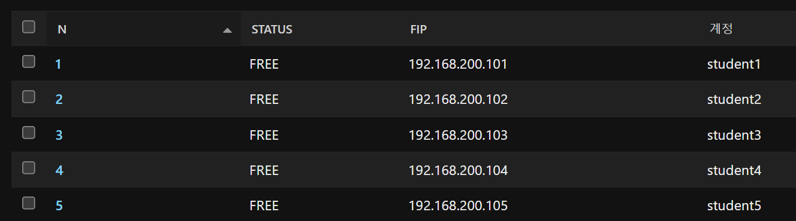
    
- **VM DB**
    
    ```python
       Column   |           Type           | Collation | Nullable |             Default
    ------------+--------------------------+-----------+----------+----------------------------------
     id         | bigint                   |           | not null | generatedby default
     student_id | character varying(32)    |           | not null |
     status     | character varying(16)    |           | not null |
     server_id  | uuid                     |           |          |
     error      | text                     |           | not null |
     created_at | timestamp with time zone |           | not null |
     updated_at | timestamp with time zone |           | not null |
     slot_id    | smallint                 |           | not null |
     claimed_at | timestamp with time zone |           |          |
     claimed_by | character varying(64)    |           | not null |
    ```
    
    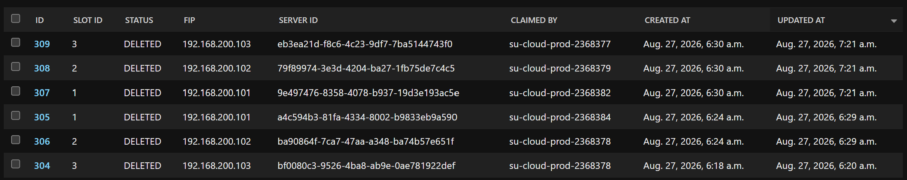
    

# Backend

- `Provisioning/services.py`
    
    ```python
    import logging
    import os
    from datetime import timedelta
    
    from django.db import transaction
    from django.db.models import Q
    from django.utils import timezone
    
    from osclient import get_conn, vm as osvm
    from wgclient import get_wg                       # [ADDED]
    from .models import Slot, Vm
    
    log = logging.getLogger(__name__)
    
    KEYFILE = os.environ.get("SU_KEYFILE", "/opt/su-portal/sdk-probe-key.pem")
    CLAIM_TIMEOUT = timedelta(minutes=10)
    
    # ── 요청 접수 ──────────────────────────────────────────────
    
    def reserve(student_id):
        """빈 슬롯 예약"""
        with transaction.atomic():
            slot = (
                Slot.objects
                .select_for_update(skip_locked=True)
                .filter(status=Slot.FREE)
                .order_by("n")
                .first()
            )
            if slot is None:
                return None
    
            slot.status = Slot.TAKEN
            slot.save(update_fields=["status"])
    
            return Vm.objects.create(slot=slot, student_id=student_id)
    
    def request_delete(vm_id):
        """회수 예약"""
        with transaction.atomic():
            rec = Vm.objects.select_for_update().get(pk=vm_id)
            if rec.status != Vm.ACTIVE:
                return None
    
            rec.status = Vm.DELETING
            rec.claimed_at = None
            rec.claimed_by = ""
            rec.save(update_fields=["status", "claimed_at", "claimed_by", "updated_at"])
            return rec
    
    def request_delete_all():
        """전체 회수 예약"""
        ids = list(
            Vm.objects.filter(status=Vm.ACTIVE)
            .order_by("slot_id")
            .values_list("id", flat=True)
        )
        return [rec for i in ids if (rec := request_delete(i)) is not None]
    
    # ── 작업 실행 ──────────────────────────────────────────────
    
    def claim(worker_id):
        """작업 집기 · 유실분 포함"""
        stale = timezone.now() - CLAIM_TIMEOUT
        with transaction.atomic():
            rec = (
                Vm.objects
                .select_for_update(skip_locked=True)
                .filter(status__in=[Vm.PROVISIONING, Vm.DELETING])
                .filter(Q(claimed_at__isnull=True) | Q(claimed_at__lt=stale))
                .order_by("created_at")
                .first()
            )
            if rec is None:
                return None
    
            rec.claimed_at = timezone.now()
            rec.claimed_by = worker_id
            rec.save(update_fields=["claimed_at", "claimed_by", "updated_at"])
            return rec
    
    def provision(vm_id):
        """VM 생성 + Warpgate 등록"""
        vm_rec = Vm.objects.get(pk=vm_id)
        conn = get_conn()
    
        adopted = _reconcile(conn, vm_rec)            # [CHANGED] 입양돼도 WG 등록은 계속 진행
    
        if not adopted:
            try:
                server = osvm.create(conn, vm_rec.slot_id, KEYFILE)
            except Exception as e:
                _mark_failed(conn, vm_rec, f"{type(e).__name__}: {e}")
                raise
            _mark_active(vm_rec, server.id)
    
        # [ADDED] Warpgate 등록 — ensure_* 라 재실행에 안전.
        # 실패 시 PROVISIONING 으로 되돌려 워커 재시도 루프에 복귀시킴.
        # (ACTIVE 로 남기면 claim 조건에서 빠져 영원히 재시도 안 됨 — 8/20 vm2 사례)
        n = vm_rec.slot_id
        try:
            wg = get_wg()
            password = wg.provision_seat(
                n=n,
                fip=osvm.fip_for(n),
                ssh_user=osvm.user_for(n),
                password=f"Student{n}!",
            )
            log.info("wg provisioned: student%s", n)
            # TODO(Phase 0.5): 비밀번호 전달 경로는 포털 UI 확정 후 결정.
            # 임시로 워커 로그에만 남김. DB 평문 저장 금지.
            log.info("wg provisioned: student%s / %s", n, password)
        except Exception:
            log.exception(
                "warpgate provision failed for vm%s, reverting to PROVISIONING for retry", n
            )
            with transaction.atomic():
                vm_rec.status = Vm.PROVISIONING
                vm_rec.claimed_at = None
                vm_rec.claimed_by = ""
                vm_rec.save(update_fields=["status", "claimed_at", "claimed_by", "updated_at"])
            raise
    
        return vm_rec
    
    def deprovision(vm_id):
        """Warpgate 해제 + VM 삭제 · 슬롯 반납"""
        vm_rec = Vm.objects.get(pk=vm_id)
        if vm_rec.status == Vm.DELETED:
            return
    
        # [ADDED] VM 삭제 전에 Warpgate 접근부터 끊는다 (죽은 target 로 로그인 시도 방지)
        try:
            get_wg().deprovision_seat(vm_rec.slot_id)
        except Exception:
            log.exception("warpgate deprovision failed for vm%s (continuing)", vm_rec.slot_id)
    
        conn = get_conn()
    
        if vm_rec.server_id:
            server = conn.compute.find_server(str(vm_rec.server_id))
            if server is not None and server.status != "DELETED":
                osvm.delete(conn, server.id)
    
        _release(vm_rec)
    
    # ── 내부 ────────────────────────────────────────────────────
    
    def _reconcile(conn, vm_rec):
        """실제 상태 대조 · 기존 VM 입양"""
        name = osvm.name_for(vm_rec.slot_id)
        server = next(
            (s for s in conn.compute.servers(name=name) if s.name == name and s.status != "DELETED"),
            None,
        )
        if server is None:
            return False
    
        if server.status == "ACTIVE":
            log.info("reconcile: %s already ACTIVE, adopting", name)
            _mark_active(vm_rec, server.id)
            return True
    
        log.info("reconcile: %s in %s, deleting for retry", name, server.status)
        osvm.delete(conn, server.id)
        return False
    
    def _mark_active(vm_rec, server_id):
        """생성 완료 기록"""
        with transaction.atomic():
            vm_rec.status = Vm.ACTIVE
            vm_rec.server_id = server_id
            vm_rec.save(update_fields=["status", "server_id", "updated_at"])
    
    def _mark_failed(conn, vm_rec, err):
        """실패 기록 · 잔여물 정리"""
        with transaction.atomic():
            vm_rec.status = Vm.FAILED
            vm_rec.error = err[:2000]
            vm_rec.save(update_fields=["status", "error", "updated_at"])
    
        name = osvm.name_for(vm_rec.slot_id)
        try:
            server = next(
                (s for s in conn.compute.servers(name=name) if s.name == name and s.status != "DELETED"),
                None,
            )
            if server is not None:
                osvm.delete(conn, server.id)
        except Exception:
            log.exception("cleanup failed for %s - slot stays TAKEN", name)
            return
    
        _free_slot(vm_rec.slot_id)
    
    def _release(vm_rec):
        """회수 기록 · 이력 보존"""
        with transaction.atomic():
            vm_rec.status = Vm.DELETED
            vm_rec.save(update_fields=["status", "updated_at"])
    
            slot = Slot.objects.select_for_update().get(pk=vm_rec.slot_id)
            slot.status = Slot.FREE
            slot.save(update_fields=["status"])
    
    def _free_slot(n):
        """슬롯 해제"""
        with transaction.atomic():
            slot = Slot.objects.select_for_update().get(pk=n)
            slot.status = Slot.FREE
            slot.save(update_fields=["status"])
    ```
    

## 생성

```bash
[교수] 발급 요청
  │
  ▼
reserve()  ┌── 트랜잭션 ──────────────────────┐
           │ Slot 중 FREE 하나를 잠금          │   ← 수 ms
           │ Slot.status = TAKEN               │
           │ Vm 행 생성 (status=PROVISIONING)  │
           └───────────────────────────────────┘
  │
  │  ※ 여기서 요청 끝. 교수 화면에 즉시 응답
  ▼
────────────── 이후는 워커 (3초마다 폴링) ──────────────
  │
  ▼
claim()    ┌── 트랜잭션 ──────────────────────┐
           │ PROVISIONING & 임자 없음 → 1건    │   ← 수 ms
           │ claimed_at = now                  │
           │ claimed_by = 워커ID               │
           └───────────────────────────────────┘
  │
  │  ※ 락 놓음. 이제부터 트랜잭션 밖
  ▼
provision()
  │
  ├─ _reconcile()      OpenStack에 vm{N}이 이미 있나?
  │                      ACTIVE  → 입양하고 생성 건너뜀
  │                      그 외   → 지우고 다시
  │                      없음    → 그냥 진행
  │
  ├─ osvm.create()     서버 생성 → FIP 연결 → cloud-init → SSH 대기   ← 27초
  │
  ├─ _mark_active()    Vm.status = ACTIVE, server_id 기록
  │
  └─ wg.provision_seat()   Warpgate에 student{N} 계정·접속 대상 등록
  │
  ▼
ACTIVE  ─  학생이 웹 터미널로 접속 가능
```

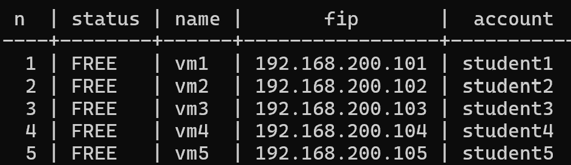

초기 상태 slot

### 1. 빈 슬롯 예약 (생성 요청)

```python
def reserve(student_id):
    """빈 슬롯 예약"""
    with transaction.atomic():
        slot = (
            Slot.objects
            .select_for_update(skip_locked=True)
            .filter(status=Slot.FREE)
            .order_by("n")
            .first()
        )
        if slot is None:
            return None

        slot.status = Slot.TAKEN
        slot.save(update_fields=["status"])

        return Vm.objects.create(slot=slot, student_id=student_id)
```

- 쿼리문
    
    ```sql
    BEGIN;
    
    SELECT n, status FROM provisioning_slot
    WHERE status = 'FREE'
    ORDER BY n ASC
    LIMIT 1
    FOR UPDATE SKIP LOCKED;          -- 다른 트랜잭션이 같은 행을 읽으려고 할 때 대기하지말고 건너 뛰라는 뜻 -> 병렬 처리
    
    UPDATE provisioning_slot SET status = 'TAKEN' WHERE n = 1; -- Free -> Taken 예약
    
    INSERT INTO provisioning_vm (slot_id, student_id, status, created_at, updated_at)
    VALUES (1, '2021001', 'PROVISIONING', now(), now());
    
    COMMIT;
    ```
    

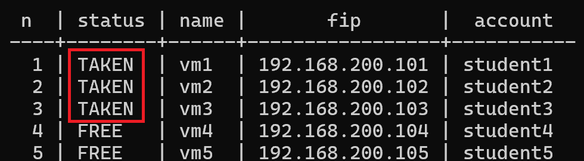

예약된 slot

### 2. 워커 slot 소유

```python
def claim(worker_id):
    """작업 집기 · 유실분 포함"""
    stale = timezone.now() - CLAIM_TIMEOUT
    with transaction.atomic():
        rec = (
            Vm.objects
            .select_for_update(skip_locked=True)
            .filter(status__in=[Vm.PROVISIONING, Vm.DELETING])
            .filter(Q(claimed_at__isnull=True) | Q(claimed_at__lt=stale))
            .order_by("created_at")
            .first()
        )
        if rec is None:
            return None

        rec.claimed_at = timezone.now()
        rec.claimed_by = worker_id
        rec.save(update_fields=["claimed_at", "claimed_by", "updated_at"])
        return rec
```

- 쿼리문
    
    ```sql
    BEGIN;
    
    SELECT * FROM provisioning_vm
    WHERE status IN ('PROVISIONING','DELETING')
      AND (claimed_at IS NULL OR claimed_at < now() - interval '10 minutes')
    ORDER BY created_at ASC
    LIMIT 1
    FOR UPDATE SKIP LOCKED;
    
    UPDATE provisioning_vm
    SET claimed_at = now(), claimed_by = 'su-cloud-prod-3859966', updated_at = now()
    WHERE id = 812;
    
    COMMIT;
    ```
    

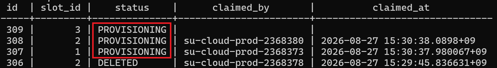

Provisioning을 worker가 소유

- `claimed_by` : Worker ID
- `claimed_at` : Worker가 잡은 시간

### 3. 프로비저닝

```python
def provision(vm_id):
    """VM 생성 + Warpgate 등록"""
    vm_rec = Vm.objects.get(pk=vm_id)
    conn = get_conn()

    adopted = _reconcile(conn, vm_rec)     # VM이 이미 있나 확인 (멱등성)
    if not adopted:
        try:
            server = osvm.create(conn, vm_rec.slot_id, KEYFILE)  # VM 생성
        except Exception as e:
            _mark_failed(conn, vm_rec, f"{type(e).__name__}: {e}")
            raise
        _mark_active(vm_rec, server.id)

    n = vm_rec.slot_id
    try:
        wg = get_wg()                      
        password = wg.provision_seat(       # Warpgate 등록
            n=n,
            fip=osvm.fip_for(n),
            ssh_user=osvm.user_for(n),
            password=f"Student{n}!",
        )
        log.info("wg provisioned: student%s", n)
        log.info("wg provisioned: student%s / %s", n, password)
    except Exception:
        log.exception(
            "warpgate provision failed for vm%s, reverting to PROVISIONING for retry", n
        )
        with transaction.atomic():
            vm_rec.status = Vm.PROVISIONING
            vm_rec.claimed_at = None
            vm_rec.claimed_by = ""
            vm_rec.save(update_fields=["status", "claimed_at", "claimed_by", "updated_at"])
        raise

    return vm_rec
```

- `_reconcile()`
    
    ```python
    def _reconcile(conn, vm_rec):
        """실제 상태 대조 · 기존 VM 입양"""
        name = osvm.name_for(vm_rec.slot_id)
        server = next(                             # VM 조회
            (s for s in conn.compute.servers(name=name) if s.name == name and s.status != "DELETED"),
            None,
        )
        if server is None:                         # VM가 없으면
            return False
    
        if server.status == "ACTIVE":              # VM이 있으면
            log.info("reconcile: %s already ACTIVE, adopting", name)
            _mark_active(vm_rec, server.id)
            return True
    
        log.info("reconcile: %s in %s, deleting for retry", name, server.status)
        osvm.delete(conn, server.id) # VM 상태 이상
        return False
    ```
    
    | OpenStack에 VM이 | `_reconcile` 반환 | 이후 |
    | --- | --- | --- |
    | `ACTIVE`로 있음 | `True` | 입양 — 생성 건너뜀 |
    | `BUILD` 등으로 있음 | `False` (삭제 후) | 재생성 |
    | 없음 | `False` | 정상 생성 |
- `osvm.create`
    
    ```python
    def create(conn, n, key_path):
        """VM 생성 → FIP 연결 → SSH 도달까지. 실패 시 예외를 올림."""
        keypair = os.environ["SU_KEYPAIR"]
        pubkey = conn.compute.get_keypair(keypair).public_key
    
        server = conn.compute.create_server(     # Openstack SDK (VM 생성)
            name=name_for(n),
            image_id=os.environ["SU_IMAGE_ID"],
            flavor_id=os.environ["SU_FLAVOR_ID"],
            networks=[{"uuid": os.environ["SU_NETWORK_ID"]}],
            key_name=keypair,
            security_groups=[{"name": os.environ["SU_SECGROUP"]}],
            user_data=build_user_data(n, pubkey),
        )
        server = conn.compute.wait_for_server(server, status="ACTIVE", wait=600)
    
        port = next(conn.network.ports(device_id=server.id))
        fip = next(conn.network.ips(floating_ip_address=fip_for(n)))
        conn.network.update_ip(fip, port_id=port.id)       # port, FIP 붙이기
    
        wait_ssh(fip_for(n), user_for(n), key_path)        # SSH 연결 대기
        return server
    ```
    
    ```python
    def wait_ssh(host, user, key_path, timeout=300):
        """SSH 도달까지 대기. ACTIVE는 준비 완료 신호가 아님."""
        deadline = time.time() + timeout
        while time.time() < deadline:
            r = subprocess.run(
                ["ssh", "-i", key_path,
                 "-o", "StrictHostKeyChecking=no",
                 "-o", "UserKnownHostsFile=/dev/null",
                 "-o", "ConnectTimeout=3",
                 f"{user}@{host}", "true"],
                capture_output=True,
            )
            if r.returncode == 0:
                return
            time.sleep(5)
        raise TimeoutError(f"ssh unreachable: {user}@{host}")
    ```
    
- `wg.provision_seat` (warpgate user, role, target bind)
    
    ```python
    def provision_seat(self, n, fip, ssh_user, expiry=None, password=None):
            """슬롯 n 발급: user student{n} + role slot-{n} + target vm{n} 을 만들고 연결.
            password 미지정 시 랜덤 생성 (반환값으로 전달)."""
            user = self.ensure_user(f"student{n}")
            role = self.ensure_role(f"slot-{n}")
            target = self.ensure_ssh_target(f"vm{n}", host=fip, username=ssh_user)
            self.bind(user["id"], target["id"], role["id"], expiry=expiry)
            return self.set_password(user["id"], password)
    ```
    

## 4. VM Active

```python
def _mark_active(vm_rec, server_id):
    """생성 완료 기록"""
    with transaction.atomic():
        vm_rec.status = Vm.ACTIVE      # ACTIVE 기록
        vm_rec.server_id = server_id
        vm_rec.save(update_fields=["status", "server_id", "updated_at"])
```

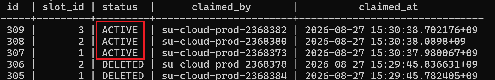

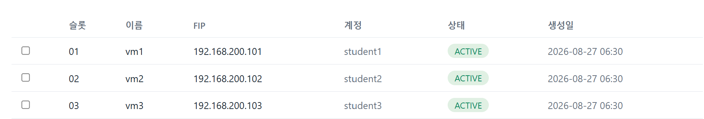

VM Active

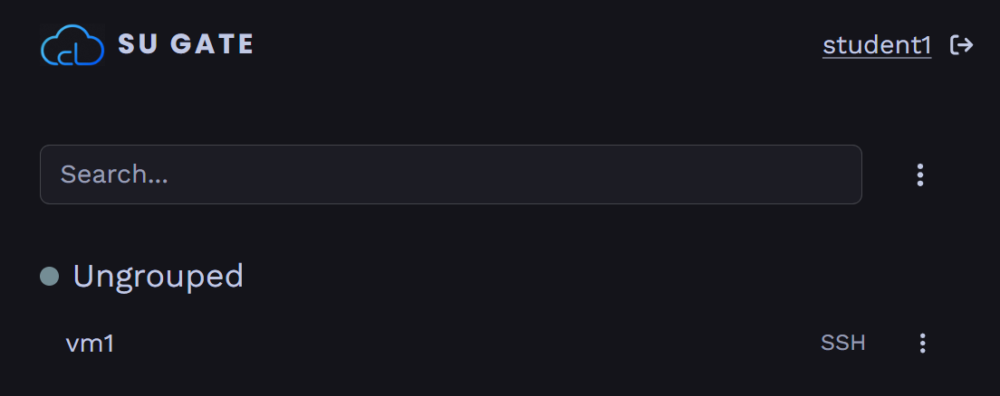

warpgate 학생 계정 접속

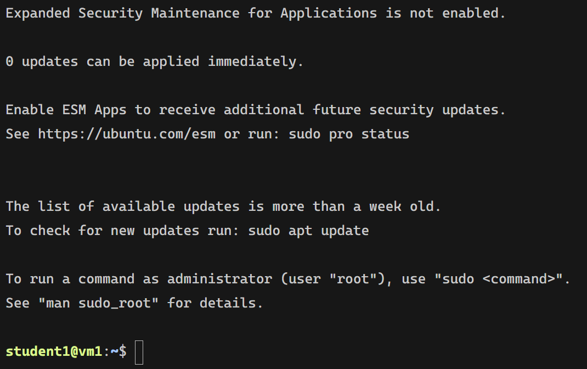

학생 SSH 접속 (웹 터미널)

---

## 회수

```bash
[종강] reclaim
  │
  ▼
request_delete_all()
  │
  └─ ACTIVE 45건 각각 ┌── 트랜잭션 ────────────┐
                      │ Vm.status = DELETING    │
                      │ claimed_at = None       │  ← 소유권 표시 리셋
                      │ claimed_by = ""         │
                      └─────────────────────────┘
  │
  │  ※ 45건 예약만 하고 즉시 반환
  ▼
────────────── 워커 ──────────────
  │
  ▼
claim()  →  DELETING 1건 집음  (생성과 같은 함수, 같은 큐)
  │
  ▼
deprovision()
  │
  ├─ wg.deprovision_seat()   접속 경로부터 끊음
  ├─ osvm.delete()           서버 삭제
  └─ _release()  ┌── 트랜잭션 ──────────┐
                 │ Vm.status = DELETED   │
                 │ Slot.status = FREE    │   ← 슬롯만 반납
                 └───────────────────────┘
  │
  ▼
DELETED  ─  Vm 행은 남음 (이력)
```

## 0. 전체 회수

```python
def request_delete_all():
    """전체 회수 예약"""
    ids = list(
        Vm.objects.filter(status=Vm.ACTIVE)
        .order_by("slot_id")
        .values_list("id", flat=True)
    )
    return [rec for i in ids if (rec := request_delete(i)) is not None]
```

## 1. VM 회수 요청

```python
def claim(worker_id):
    """작업 집기 · 유실분 포함"""
    stale = timezone.now() - CLAIM_TIMEOUT
    with transaction.atomic():
        rec = (
            Vm.objects
            .select_for_update(skip_locked=True)
            .filter(status__in=[Vm.PROVISIONING, Vm.DELETING])
            .filter(Q(claimed_at__isnull=True) | Q(claimed_at__lt=stale))
            .order_by("created_at")
            .first()
        )
        if rec is None:
            return None

        rec.claimed_at = timezone.now()
        rec.claimed_by = worker_id
        rec.save(update_fields=["claimed_at", "claimed_by", "updated_at"])
        return rec
```

```python
def request_delete(vm_id):
    """회수 예약"""
    with transaction.atomic():
        rec = Vm.objects.select_for_update().get(pk=vm_id)
        if rec.status != Vm.ACTIVE:
            return None

        rec.status = Vm.DELETING
        rec.claimed_at = None
        rec.claimed_by = ""
        rec.save(update_fields=["status", "claimed_at", "claimed_by", "updated_at"])
        return rec
```

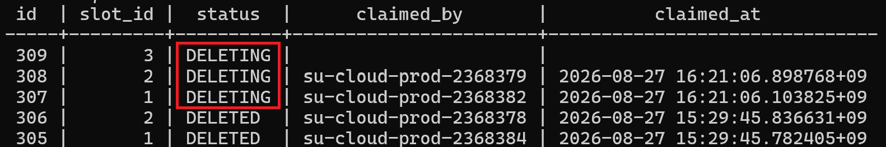

DELETING을 worker가 소유

## 2. Deprovisioning

```python
def deprovision(vm_id):
    """Warpgate 해제 + VM 삭제 · 슬롯 반납"""
    vm_rec = Vm.objects.get(pk=vm_id)
    if vm_rec.status == Vm.DELETED:                             
        return

    try:
        get_wg().deprovision_seat(vm_rec.slot_id)                # warpgate 연동 해제
    except Exception:
        log.exception("warpgate deprovision failed for vm%s (continuing)", vm_rec.slot_id)

    conn = get_conn()

    if vm_rec.server_id:
        server = conn.compute.find_server(str(vm_rec.server_id)) # VM 찾아서
        if server is not None and server.status != "DELETED":
            osvm.delete(conn, server.id)                         # VM 삭제

    _release(vm_rec)
```

- `deprovision_seat`
    
    ```python
    def deprovision_seat(self, n):
            """슬롯 n 회수: target → user → role 순서로 제거."""
            self.delete_target(f"vm{n}")
            self.delete_user(f"student{n}")
            self.delete_role(f"slot-{n}")
    ```
    
- `osvm.delete`
    
    ```python
    def delete(conn, server_id):
        """포트·FIP는 Neutron이 함께 정리함."""
        conn.compute.delete_server(server_id)
        conn.compute.wait_for_delete(conn.compute.get_server(server_id), wait=300)
    ```
    

## 3. slot 해제

```python
def _release(vm_rec):
    """회수 기록 · 이력 보존"""
    with transaction.atomic():
        vm_rec.status = Vm.DELETED       # VM을 DELETED로 남겨 이력 보존
        vm_rec.save(update_fields=["status", "updated_at"])

        slot = Slot.objects.select_for_update().get(pk=vm_rec.slot_id)
        slot.status = Slot.FREE          # slot TAKEN -> FREE
        slot.save(update_fields=["status"])
```

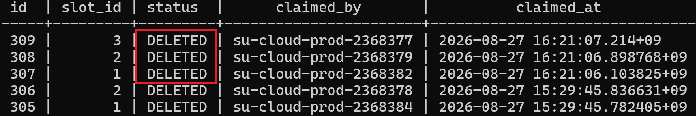

VM DELETED로 남겨 이력 보존

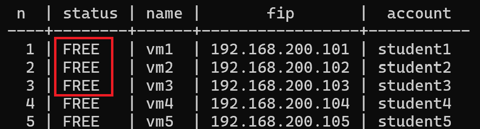

slot 해제 (TAKEN → FREE)

---

## 생성 실패시

```bash
osvm.create() 예외
  │
  ▼
_mark_failed()
  │
  ├─ Vm.status = FAILED, error 기록      ← 슬롯은 아직 TAKEN
  │
  ├─ OpenStack에 vm{N} 잔여물 있나? 지움
  │      성공 → Slot.status = FREE       ← 정리된 뒤에만 반납
  │      실패 → TAKEN 유지, 운영자 개입
  ▼
FAILED  ─  claim 대상에서 빠짐 (무한 재시도 안 됨)
```

```python
def _mark_failed(conn, vm_rec, err):
    """실패 기록 · 잔여물 정리"""
    with transaction.atomic():
        vm_rec.status = Vm.FAILED    # Status = Failed
        vm_rec.error = err[:2000]    # error code
        vm_rec.save(update_fields=["status", "error", "updated_at"])

    name = osvm.name_for(vm_rec.slot_id)
    try:
        server = next( # VM 이름으로 조회 (생성 실패 시 server id가 부여되지 않기 때문)
            (s for s in conn.compute.servers(name=name) if s.name == name and s.status != "DELETED"),
            None,
        )
        if server is not None: # VM이 있다면 삭제
            osvm.delete(conn, server.id)
    except Exception: # 정리 실패 시 로그로 남기고 slot은 Taken -> 사람 개입
        log.exception("cleanup failed for %s - slot stays TAKEN", name)
        return

    _free_slot(vm_rec.slot_id) # 슬롯 해제
```

```python
def _free_slot(n):
    """슬롯 해제"""
    with transaction.atomic():
        slot = Slot.objects.select_for_update().get(pk=n)
        slot.status = Slot.FREE # TAKEN -> FREE
        slot.save(update_fields=["status"])
```

---

## 워커가 죽었을때

```bash
claim()으로 집음 → claimed_at 찍힘 → [ kill -9 ]
  │
  │  Vm은 PROVISIONING, claimed_at은 찍힌 채 방치
  │
  ▼  10분 경과
다른 워커의 claim() 필터에 다시 걸림  (claimed_at < now-10분)
  │
  ▼
_reconcile()  →  OpenStack에 vm{N} ACTIVE로 있음
  │
  ▼
	입양 — 재생성 없이 DB만 ACTIVE로. server_id 동일
```

- `claim` (Worker 소유권 주장)
    
    ```python
    ...
    
    CLAIM_TIMEOUT = timedelta(minutes=10)
    
    ...
    
    def claim(worker_id):
        """작업 집기 · 유실분 포함"""
        stale = timezone.now() - CLAIM_TIMEOUT
        with transaction.atomic():
            rec = (
                Vm.objects
                .select_for_update(skip_locked=True)
                .filter(status__in=[Vm.PROVISIONING, Vm.DELETING])
                .filter(Q(claimed_at__isnull=True) | Q(claimed_at__lt=stale))
                .order_by("created_at")
                .first()
            )
            if rec is None:
                return None
    
            rec.claimed_at = timezone.now()
            rec.claimed_by = worker_id
            rec.save(update_fields=["claimed_at", "claimed_by", "updated_at"])
            return rec
    ```
    
- `_reconcile`
    
    ```python
    def _reconcile(conn, vm_rec):
        """실제 상태 대조 · 기존 VM 입양"""
        name = osvm.name_for(vm_rec.slot_id)
        server = next(                             # VM 조회
            (s for s in conn.compute.servers(name=name) if s.name == name and s.status != "DELETED"),
            None,
        )
        if server is None:                         # VM가 없으면
            return False
    
        if server.status == "ACTIVE":              # VM이 있으면 입양
            log.info("reconcile: %s already ACTIVE, adopting", name)
            _mark_active(vm_rec, server.id)
            return True
    
        log.info("reconcile: %s in %s, deleting for retry", name, server.status)
        osvm.delete(conn, server.id) # VM 상태 이상
        return False
    ```
    

---

## Worker

```python
import os
import signal
import socket
import time

from django.core.management.base import BaseCommand

from provisioning import services
from provisioning.models import Vm

class Command(BaseCommand):
    help = "PROVISIONING / DELETING 상태의 Vm 레코드를 집어 처리함"

    def add_arguments(self, parser):
        parser.add_argument("--interval", type=float, default=3.0)

    def handle(self, *args, **opts):
        worker_id = f"{socket.gethostname()}-{os.getpid()}"   # Worker id 생성
        stopping = False

        def stop(signum, frame):  # Signal handler
            nonlocal stopping
            stopping = True

        signal.signal(signal.SIGTERM, stop) # systemctl stop
        signal.signal(signal.SIGINT, stop)  # Ctrl+C

        self.stdout.write(f"worker {worker_id} started")

        while not stopping:              # polling loop
            rec = services.claim(worker_id)
            if rec is None:
                time.sleep(opts["interval"]) # interval = 3.0s
                continue

            self.stdout.write(f"claim vm{rec.slot_id} ({rec.status})")
            try:
                if rec.status == Vm.DELETING:  # VM 삭제
                    services.deprovision(rec.id)
                    self.stdout.write(f"  vm{rec.slot_id} DELETED")
                else:
                    services.provision(rec.id) # VM Provisioning
                    self.stdout.write(f"  vm{rec.slot_id} ACTIVE")
            except Exception as e: # error시 로그를 남기고 다시 loop 수행
                self.stdout.write(f"  vm{rec.slot_id} ERROR: {type(e).__name__}: {e}")

        self.stdout.write("worker stopped")
```

### 워커를 둔 이유

- 배경
    - VM 하나 만드는데 27초가 걸림 (Nova 생성 + FIP 연결 + SSH 도달 대기 + Warpgate 등록)
    - HTTP 요청 안에서 처리하면 브라우저가 4분 동안 멈춰있음
    - 중간에 창을 닫거나 타임아웃 나면 어디까지 진행했는지 확인 불가
- 구조
    - 요청 수락 : ms 단위, DB에만 기록 → 즉시 응답
    - 실제 작업 : 27초, Openstack & Warpgate → 워커가 처리

### DB 폴링 + Worker가 표준인가

```bash
### 워커(DB-as-queue) 방식 검증

- 문제 제기: `Slot`/`Vm` 테이블 폴링 + 워커 방식이 표준(정배) 방식인지 의문
- 조사 포인트:
    - DB 폴링 워커 vs 메시지 큐 (Celery + RabbitMQ/Redis 등) vs API 직접 호출 + 컨트롤러 계층
    - 각 방식의 장단점, 확장성, 유지보수 가능성
    - Kubernetes 없이 컨트롤러 패턴이 성립하는지
```

Python/Django 생태계에서 **가장 흔한 기본값은 Celery + Redis/RabbitMQ**

Celery가 제공하는 것들

- 워커 프로세스 관리, 오토스케일
- 재시도 정책 (지수 백오프, 최대 횟수)
- 스케줄링 (Celery Beat — 학기말 자동 회수 같은 것)
- 작업 체이닝·그룹핑
- Flower로 모니터링

**작업이 많고 종류가 다양하며 실패 패턴이 복잡할수록** 이걸 직접 만드는 것보다 가져다 쓰는 게 낫다.

그러나 최근 흐름은 반대 방향으로 움직이고 있음

| 프레임워크 | 배경 작업 기본값 |
| --- | --- |
| **Rails 8** (2024.11) | **Solid Queue — DB 기반.** Redis 없이 동작하는 것을 기본으로 채택 |
| **Elixir** | **Oban — PostgreSQL 기반.** 사실상 표준 위치 |
| **Django** | DEP 14 배경 작업 API 논의 중. 참조 구현 `django-tasks`에 DB 백엔드 포함 |

#### DB 폴링 장점

- **트랜잭션 일관성** — 슬롯 예약과 작업 등록이 같은 DB 트랜잭션 안에서 일어납니다. 브로커를 쓰면 "DB엔 커밋됐는데 큐 발행이 실패"하는 경우를 따로 처리해야 합니다
- **운영 단순성** — 장애 지점이 하나 줄어듭니다

PostgreSQL 9.5(2016)에서 `SKIP LOCKED`가 추가되면서 **DB를 큐로 쓰는 것이 실용적인 선택지가 됨**

- `SKIP LOCKED`란
    
    PostgreSQL에서 `SELECT ... FOR UPDATE`는 조회한 **행에 잠금을 검**. 다른 트랜잭션이 같은 행을 잠그려 하면 어떻게 되느냐가 옵션에 따라 갈림.
    
    | 옵션 | 다른 트랜잭션이 이미 잠근 행을 만나면 |
    | --- | --- |
    | (기본) | **기다림.** 앞 트랜잭션이 끝날 때까지 블로킹 |
    | `NOWAIT` | **에러.** 즉시 실패 |
    | `SKIP LOCKED` | **건너뜀.** 그 행을 없는 셈 치고 다음 행을 반환 |
    
    **`SKIP LOCKED` 없이:**
    
    ```
    워커1  SELECT ... FOR UPDATE LIMIT 1  → vm1 잠금
    워커2  SELECT ... FOR UPDATE LIMIT 1  → vm1에서 대기...
    워커3                                 → vm1에서 대기...
    ...
    워커8                                 → vm1에서 대기...
    ```
    
    전부 같은 "첫 번째 행"을 노리므로 **8개가 줄을 섭니다.** 워커를 늘려도 처리량이 안 늘어납니다. 병렬화가 무의미해집니다.
    
    **`SKIP LOCKED`로:**
    
    ```
    워커1  → vm1 잠금
    워커2  → vm1 잠겼네, 건너뜀 → vm2 잠금
    워커3  → vm1, vm2 건너뜀   → vm3 잠금
    ...
    워커8  → vm8 잠금
    ```
    
    각자 다른 행을 집습니다
    
    그러나 DB 잠금은 트랜잭션이 끝나면 풀려 다른 트랜잭션이 접근할 수 있음
    
    그래서 두 단계로 나눔
    
    ```bash
    1. 짧은 트랜잭션 (ms)
       SELECT ... FOR UPDATE SKIP LOCKED
       claimed_by = '워커식별자'
       claimed_at = now()
       COMMIT  ← 여기서 DB 잠금은 풀림
    
    2. 트랜잭션 밖 (27초)
       OpenStack 생성, FIP, SSH 대기, Warpgate 등록
    ```
    
    DB 잠금은 "누가 집을지 정하는" 순간에만 쓰고, 그 이후는 `claimed_by`라는 논리적 표시로 소유권을 유지
    
    `CLAIM_TIMEOUT`(10분)이 여기 붙어, 워커가 27초 작업 중에 죽으면 `claimed_by`는 남아 있는데 아무도 처리하지 않는 상태가 됨. 이후 10분이 지나면 다른 워커가 회수합니다.
    

#### 다른 선택지

| # | 방식 | 한 줄 정의 |
| --- | --- | --- |
| A | **동기 직접 호출** | 요청 처리 중에 OpenStack API를 그대로 호출하고 끝날 때까지 대기 |
| B | **잡 큐 — DB 백엔드** | 작업을 DB 행으로 기록하고 워커가 집어 처리 (현재 방식) |
| C | **잡 큐 — 브로커** | 작업을 메시지로 발행하고 Celery 워커가 소비 |
| D | **컨트롤러 / 조정 루프** | 원하는 상태를 선언하고, 루프가 실제 상태를 그쪽으로 수렴시킴 |
- 선택지 설명
    
    ## A. 동기 직접 호출
    
    ```
    HTTP 요청 → openstacksdk 호출 → 27초 대기 → 응답
    ```
    
    ### 장점
    
    - 구조가 가장 단순함. 워커·큐·상태 머신이 전부 불필요
    - 실패가 즉시 호출자에게 전달됨
    
    ### 단점 — 우리 경우 치명적
    
    VM 하나 생성에 **27초**가 걸림 (Nova 생성 + FIP 연결 + SSH 도달 대기 + Warpgate 등록).
    
    - 45명분을 요청하면 브라우저가 **약 20분간 응답 없음.** 대부분의 프록시·브라우저 타임아웃을 넘김
    - gunicorn 워커 3개가 전부 점유되어 **다른 요청을 못 받음**
    - 연결이 끊기면 어디까지 진행됐는지 알 수 없음. OpenStack에는 VM이 남고 DB에는 기록이 없는 상태가 발생
    
    **요청 수락과 실제 작업의 소요 시간 차이가 4~5자릿수(ms vs 27초)일 때는 분리가 강제됨.** 이것이 B·C·D가 존재하는 이유임.
    
    ---
    
    ## B. 잡 큐, DB 백엔드 (현재 방식)
    
    ```python
    # 예약 — 요청 경로, ms 단위
    Slot.objects.select_for_update(skip_locked=True).filter(status=FREE).first()
    
    # 처리 — 워커, 27초
    Vm.objects.select_for_update(skip_locked=True).filter(status=PROVISIONING)
    ```
    
    `SKIP LOCKED`는 한 워커가 잠근 행을 다른 워커가 **기다리지 않고 건너뛰게** 함. 이것으로 별도 브로커 없이 배타적 작업 분배가 성립함.
    
    ### 장점
    
    **트랜잭션 일관성** — 슬롯 예약과 작업 등록이 같은 DB 트랜잭션 안에서 일어남. 커밋되면 둘 다, 실패하면 둘 다 없음. 중간 상태가 원리적으로 불가능함.
    
    **단일 진실 원천** — 도메인 상태(누가 어느 슬롯을 쓰는가)와 작업 상태(생성 중인가)가 같은 테이블에 있음. `Vm` 한 곳만 보면 전부 파악됨. Django Admin이 그대로 관리 콘솔이 됨.
    
    **장애 지점 최소화** — DB가 죽으면 어차피 서비스가 멈춤. 브로커를 추가하면 "DB는 살아 있는데 큐가 죽은" 상태를 따로 처리해야 함.
    
    **유실 방지가 자연스러움** — 작업이 DB에 영속하므로 워커가 kill되거나 서버가 재부팅돼도 행이 남아 있음. `claimed_at`/`claimed_by` + `CLAIM_TIMEOUT`으로 스테일 회수를 구현함.
    
    ### 단점
    
    **폴링 지연** — 실측 2초. 27초짜리 작업 앞에서는 무의미하나, 밀리초 응답이 필요한 도메인이라면 문제임. (`LISTEN/NOTIFY`로 제거 가능)
    
    **DB 부하가 워커 수 × 폴링 빈도에 비례** — 워커 8개, 2초 간격이면 초당 4쿼리. 현재 규모에서는 무시 가능하나, 워커 수백 개 규모에서는 설계를 바꿔야 함.
    
    **부가 기능을 직접 만들어야 함** — 재시도 정책, 스케줄링, 우선순위, 작업 체이닝이 기본 제공되지 않음. **이것이 현재 설계의 실질적 약점임 (§8 참조).**
    
    ### 실제 채택 사례
    
    Oban(Elixir), Solid Queue(Rails 8), procrastinate·pgqueuer(Python), River(Go), pg-boss(Node), Que(Ruby) — 모두 PostgreSQL `SKIP LOCKED` 기반. 주변부 기법이 아님.
    
    ---
    
    ## C. 잡 큐, 브로커 (Celery + Redis/RabbitMQ)
    
    ### 장점
    
    | 기능 | 내용 |
    | --- | --- |
    | 재시도 정책 | 지수 백오프, 최대 횟수, 예외별 분기가 데코레이터 한 줄 |
    | 스케줄링 | Celery Beat — **학기말 자동 회수를 크론 없이 구현 가능** |
    | 모니터링 | Flower로 작업 상태·처리량·실패율 시각화 |
    | 확장 | 워커 오토스케일, 큐 라우팅, 우선순위 |
    | 처리량 | 초당 수천 건 |
    
    성숙도가 높고 문서·사례가 압도적으로 많음. 팀에 익숙한 사람이 있다면 진입 비용이 낮음.
    
    ### 단점
    
    **이중 쓰기 문제 (dual write)** — 가장 실질적인 기술적 단점임.
    
    python
    
    ```python
    slot.status = TAKEN
    
    slot.save()            # DB 커밋
    
    provision.delay(slot.id) # 브로커 발행  ← 여기서 실패하면?
    ```
    
    DB는 커밋됐는데 메시지 발행이 실패하면 **슬롯은 점유됐으나 아무도 처리하지 않는 상태**가 됨. 반대로 발행 후 DB 트랜잭션이 롤백되면 존재하지 않는 슬롯을 처리하려 함.
    
    해결책은 있으나(`transaction.on_commit`, 아웃박스 패턴) **DB 백엔드에서는 원리적으로 발생하지 않는 문제를 추가로 다뤄야 함.**
    
    **진실 원천 이원화** — 작업 상태는 브로커/결과 백엔드에, 도메인 상태는 DB에 있음. "vm12가 왜 안 만들어졌나"를 보려면 두 곳을 대조해야 함.
    
    **운영 부담** — 프로세스 하나가 늘고 장애 지점이 늘어남. Redis는 기본 설정에서 영속성이 약해 재시작 시 작업이 사라질 수 있고(AOF/RDB 설정 필요), RabbitMQ는 별도 학습이 필요함.
    
    **규모 대비 과잉** — 초당 수천 건 처리 능력이 **학기당 45건**에 필요하지 않음.
    
    ---
    
    ## D. 컨트롤러 / 조정 루프
    
    Kubernetes의 핵심 패턴. **명령이 아니라 상태를 선언함.**
    
    ```
    잡 큐   : "VM을 만들어라"        (명령, 1회성)
    컨트롤러 : "VM 45대가 있어야 한다" (선언, 지속적)
    ```
    
    컨트롤러 루프는 **원하는 상태**와 **실제 상태**를 계속 비교해 차이를 메움. 작업이 끝나도 루프는 멈추지 않으므로, 누군가 VM을 임의로 지우면 다시 만듦.
    
    ### 장점
    
    **멱등성이 설계에 내장됨** — 몇 번을 다시 실행해도 같은 결과로 수렴함. 재시도가 별도 기능이 아니라 루프의 자연스러운 동작임.
    
    **자가 치유** — 드리프트(실제 상태가 선언과 어긋남)를 자동 교정함. Horizon에서 누군가 VM을 지워도 다음 루프에서 복구됨.
    
    **부분 실패에 강함** — 45대 중 3대만 실패했다면 다음 루프가 그 3대만 다시 시도함. 어디까지 성공했는지 추적할 필요가 없음.
    
    ### 단점
    
    **전체 상태 조회 비용** — 매 루프마다 실제 상태를 확인해야 함. OpenStack API를 45번 호출하는 것이 주기적으로 반복됨. K8s는 watch/informer 캐시로 이를 완화하나, 우리는 그런 장치가 없음.
    
    **개별 요청 추적이 어려움** — "교수님이 방금 요청한 건이 어떻게 됐나"를 답하기 어려움. 컨트롤러는 전체 수렴만 알지 요청 단위를 모름.
    
    **의도치 않은 복구** — 운영자가 문제 있는 VM을 일부러 지웠는데 컨트롤러가 되살릴 수 있음. 선언을 먼저 바꿔야 하는 규율이 필요함.
    
    ### K8s 없이 성립하는가 — 성립함
    
    컨트롤러 패턴에 필요한 것은 셋뿐임.
    
    | 구성 요소 | Kubernetes | 우리 |
    | --- | --- | --- |
    | 원하는 상태 저장소 | etcd | **PostgreSQL** |
    | 조정 루프 | controller-manager | **워커 프로세스** |
    | 멱등 수렴 로직 | Reconcile() | **`_reconcile()`** |
    
    Kubernetes는 이 패턴의 **한 구현체이지 전제 조건이 아님.**
    
    더 가까운 예가 있음 — **우리가 올려둔 OpenStack Nova 자체가 조정 루프로 동작함.** `nova-compute`는 주기 태스크로 하이퍼바이저의 실제 상태와 DB 기대 상태를 대조해 수렴시킴. K8s보다 먼저 나온 설계임.
    
    ---
    
    ## 비교표
    
    | 기준 | A 동기 | B DB 큐 (현재) | C 브로커 | D 컨트롤러 |
    | --- | --- | --- | --- | --- |
    | 요청 응답 시간 | 27초~20분 | **ms** | ms | ms |
    | 트랜잭션 일관성 | 해당 없음 | **보장** | 이중 쓰기 문제 | 보장 |
    | 진실 원천 | — | **단일 (DB)** | 이원화 | 단일 |
    | 추가 프로세스 | 없음 | 워커 | 워커 + 브로커 | 컨트롤러 |
    | 유실 방지 | 없음 | claim + timeout | ack/nack | 루프가 재시도 |
    | 재시도 정책 | 없음 | **직접 구현** | 기본 제공 | 내장 |
    | 스케줄링 | 없음 | **없음 (크론)** | Beat 제공 | 루프 자체 |
    | 드리프트 감지 | 없음 | **없음** | 없음 | **있음** |
    | 처리량 상한 | — | 초당 수십~수백 | 초당 수천 | 루프 주기에 종속 |
    | 운영 난이도 | 최저 | **낮음** | 중간 | 중간 |
    | 개별 요청 추적 | 쉬움 | **쉬움** | 쉬움 | 어려움 |

#### 현재 설계 위치

B와 D의 하이브리드

- `Slot`/`Vm` 테이블이 **원하는 상태 선언**에 해당 (D적 성격)
- `_reconcile()`이 **멱등 수렴 게이트**로 이미 존재 (D적 성격)
- 다만 처리는 상태 전이마다 1회성이고, 지속적으로 드리프트를 감시하지는 않음 (B적 성격)

즉 "컨트롤러 패턴을 안 쓴 것"이 아니라 **부분적으로 채택한 상태**

#### 현재 설계에서 빠진 것

- **재시도 상한이 없음**
    - Warpgate 등록 실패 경로에 최대 재시도 횟수가 없음. 영구적 실패(토큰 만료 등)가 발생하면 워커가 계속 같은 작업을 붙잡을 수 있음.
    - Celery라면 `max_retries=3, retry_backoff=True` 한 줄로 끝남. **직접 구현해야 하며, 아직 안 함.**
- **스케줄링이 없음**
    - 학기말 자동 회수가 수동임. Celery Beat가 제공하는 기능이며, 현재는 크론이나 systemd timer로 별도 구성해야 함.
- **드리프트 감지가 없음**
    - 누군가 Horizon에서 VM을 직접 지우면 DB는 `ACTIVE`인데 실물이 없는 상태가 됨. **아무도 눈치채지 못함.**
    - D 패턴을 더 채택하면 해결되며, 실제로 `_reconcile()`을 주기 실행하는 것만으로 상당 부분 커버됨.
- **관측성이 로그에 의존**
    - Flower 같은 대시보드가 없음. Django Admin에서 상태는 보이나 처리량·실패율 추이는 안 보임.

#### 결론과 전환 조건

**결론**

현재 방식은 **표준에서 벗어난 선택이 아니며**, Rails 8·Elixir 생태계가 기본값으로 채택한 것과 같은 패턴임. 우리 규모(학기당 45건)에서 브로커는 사용되지 않는 능력에 대한 운영 비용만 발생시킴.

다만 **"브로커가 필요 없다"와 "잡 큐 기능이 전부 필요 없다"는 다름.** §9의 네 항목은 브로커 없이도 구현해야 할 것들이며, 미구현 상태임을 인정함.

**우선 보완 (브로커 없이 가능)**

| # | 항목 | 방법 |
| --- | --- | --- |
| 1 | 재시도 상한 | `Vm`에 `retry_count` 추가, 상한 초과 시 `FAILED` 확정 |
| 2 | 드리프트 감지 | `_reconcile()`을 주기 실행하는 systemd timer |
| 3 | 학기말 자동 회수 | systemd timer + `reclaim --yes` |
| 4 | 폴링 지연 제거 | PostgreSQL `LISTEN/NOTIFY` (선택) |

**1·2번이 D 패턴을 더 끌어오는 방향이며, 실질 개선 효과가 가장 큼.**

#### 전환을 검토할 시점

아래 중 하나라도 해당하면 Celery 또는 `django-tasks` 도입을 재검토함.

- 하이퍼바이저가 여러 대로 늘어 워커가 수십 개 규모가 될 때
- 작업 종류가 프로비저닝 외에 여러 갈래로 늘어날 때 (스냅샷, 백업, 이미지 빌드 등)
- 초당 수십 건 이상의 작업이 발생할 때
- 복잡한 워크플로(체이닝, 조건 분기, 팬아웃)가 필요해질 때

### Worker 수 조절

```bash
# 증설 - 4 ~ 8 총 5개의 worker를 증설
sudo systemctl enable --now su-portal-worker@{4..8}

# 축소 - 4 ~ 8 총 5개의 worker 축소
sudo systemctl disable --now su-portal-worker@{4..8}

# 확인
systemctl is-active su-portal-worker@{1..8}
```

| 옵션 | 하는 일 |
| --- | --- |
| `enable` | 부팅 시 자동 시작 등록 |
| `--now` | 지금 바로 시작도 같이 |
| `disable --now` | 등록 해제 + 지금 중지 |

### worker 유닛 파일

```python
# /etc/systemd/system/su-portal-worker@.service
[Unit]
Description=SU Cloud Portal provisioning worker %i
After=network-online.target postgresql.service
Wants=network-online.target

[Service]
Type=simple # 데몬
User=ubuntu
WorkingDirectory=/opt/su-portal
Environment=PYTHONUNBUFFERED=1
ExecStart=/opt/su-portal/.venv/bin/python manage.py worker
Restart=always # 프로세스 죽으면 재기동
RestartSec=5   # 5초뒤 재기동
TimeoutStopSec=120 # systemctl stop은 SIGTERM을 보내고 나서의 대기 시간

[Install]
WantedBy=multi-user.target
```

### Web 유닛 파일 (gunicorn)

```python
# /etc/systemd/system/su-portal-web.service
[Unit]
Description=SU Cloud Portal web
After=network-online.target postgresql.service
Wants=network-online.target

[Service]
Type=simple
User=ubuntu
WorkingDirectory=/opt/su-portal
Environment=PYTHONUNBUFFERED=1
ExecStart=/opt/su-portal/.venv/bin/gunicorn config.wsgi:application \
          --bind 127.0.0.1:8001 --workers 3 # 외부에서 직접 접근 불가하고 nginx만 붙음
Restart=always
RestartSec=5

[Install]
WantedBy=multi-user.target
```

|  | web | worker |
| --- | --- | --- |
| 하는 일 | 요청 접수 (DB만) | 작업 실행 (DB + OpenStack + WG) |
| 작업 길이 | 수 ms | 27초 |
| 개수 조절 | gunicorn `--workers 3` (프로세스 내부) | systemd 인스턴스 1~8 |
| 종료 대기 | 90초 (기본) | 120초 |
| 외부 노출 | nginx 경유 | 없음 |
- **`gunicorn`**
    
    gunicorn은 **WSGI 서버**입니다. 소켓을 열고, 요청을 받아 WSGI 규격으로 Django에 넘기고, 돌아온 응답을 HTTP로 내보냅니다.
    
    ```bash
    nginx → gunicorn → Django
    HTTP    WSGI 변환   뷰 함수
    ```
    
    ### 후보
    
    | 서버 | 규격 | 특징 |
    | --- | --- | --- |
    | **gunicorn** | WSGI | 순수 Python, 설정 단순 |
    | **uWSGI** | WSGI | 기능 많음, 설정 방대 |
    | **uvicorn** | ASGI | 비동기 |
    | **waitress** | WSGI | 순수 Python, 윈도우 지원 |
    
    ### gunicorn을 고른 이유
    
    **1. 사실상 Django 배포의 기본값,** 문제가 생겼을 때 검색으로 답이 나올 확률이 가장 높습니다.
    
    **2. 설정이 단순.** 명령줄 두 개면 끝납니다.
    
    ```
    --bind 127.0.0.1:8001 --workers 3
    ```
    
    uWSGI는 옵션이 수백 개고 `.ini` 파일을 따로 씁니다. 기능은 많은데 **우리는 그 기능을 안 씁니다.** 참고로 이 서버의 Horizon이 uWSGI로 도는데, Kolla가 그렇게 구성한 것이지 우리 선택은 아닙니다.
    
    **3. 순수 Python이라 pip로 끝납니다.** 컴파일이나 시스템 패키지가 필요 없어서 `.venv` 안에 들어갑니다. 재현이 쉽습니다.
    
    **4. systemd와 잘 맞습니다.** 포그라운드로 돌고 stdout에 로그를 씁니다. `Type=simple` + journald 조합이 그대로 됩니다.
    
    ### uvicorn을 안 쓴 이유
    
    ASGI(비동기) 서버입니다. 비동기가 이득을 보는 건 **I/O 대기가 많고 동시 접속이 많을 때**입니다.
    
    우리는 반대입니다.
    
    - **openstacksdk가 동기 라이브러리**입니다. async로 감싸도 실제로는 블로킹됩니다
    - 무거운 작업은 gunicorn이 아니라 별도 프로비저닝 워커가 처리합니다
    - 동시 접속이 교수·운영자 몇 명입니다
    
    **비동기로 얻을 게 없습니다.** Django를 고른 이유(openstacksdk 공식 지원, Admin 활용)와 같은 맥락입니다.
